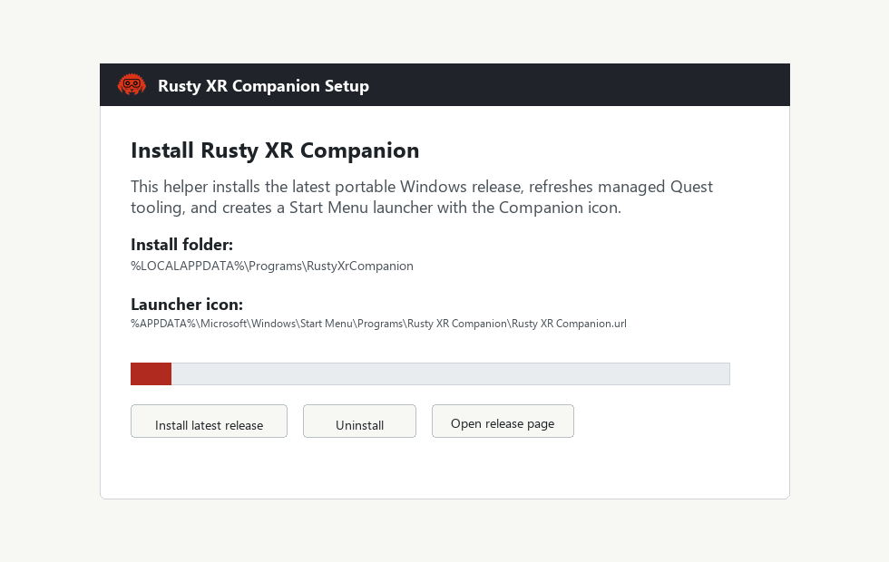
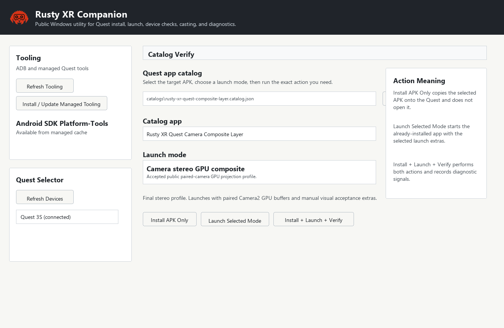

# Consumer Quick Start

This path is for someone installing the published Windows build and testing the
bundled Rusty XR Quest camera composite-layer example.

## Install

Download and run the setup helper:

[Download RustyXrCompanion-Setup.exe](https://github.com/MesmerPrism/Rusty-XR-Companion-Apps/releases/latest/download/RustyXrCompanion-Setup.exe)

The setup helper shows the install folder and Start Menu launcher location
before it changes anything:

- install folder: `%LOCALAPPDATA%\Programs\RustyXrCompanion`
- launcher icon: `%APPDATA%\Microsoft\Windows\Start Menu\Programs\Rusty XR Companion\Rusty XR Companion.lnk`

## First Launch

Open **Rusty XR Companion** from the Start Menu. The app checks for release
updates on startup, then loads the bundled Rusty XR composite-layer catalog if
the bundled APK is present.

Use the left column first:

- **Install / Update Managed Tooling** installs `adb`, `hzdb`, and `scrcpy` into the app-managed LocalAppData cache.
- **Install / Update Media Runtime** installs the optional FFmpeg media
  runtime used for saved H.264 preview decode. The app zip does not bundle
  FFmpeg; this action downloads a verified upstream LGPL shared build into the
  app-managed LocalAppData cache.
- **Refresh Devices** reads the connected Quest list.
- **Enable Wi-Fi ADB From USB** is optional; use it only after USB debugging is trusted.

## Install And Launch The Example

The **Catalog Verify** tab is the quickest path for the bundled example.

Use the controls in this order:

- Select **Rusty XR Quest Camera Composite Layer** in **Catalog app**.
- Select a **Launch mode**. Each mode is the same APK with different launch extras.
- Use **Install APK Only** to copy the APK onto the Quest without opening it.
- Use **Launch Selected Mode** to launch an already-installed APK with the selected mode.
- Use **Install + Launch + Verify** when you want the full diagnostic pass. It installs, applies the device profile, launches the selected mode, waits, and records process, foreground, `gfxinfo`, and memory signals.

## Launch Modes

- **Synthetic layer smoke test** starts the OpenXR renderer without camera or screen capture.
- **Camera source diagnostics** enumerates the public Camera2 sources and writes diagnostics for verification bundles.
- **Camera diagnostic CPU copy** uses a throttled CPU camera-copy path for route and renderer isolation.
- **Camera GPU buffer probe** checks Camera2 `PRIVATE` buffer availability without claiming final stereo alignment.
- **Camera stereo GPU composite** is the accepted public paired-camera GPU projection profile.
- **Camera stereo GPU composite, quad-surface mode** is a comparison mode for projection geometry and tone checks.
- **MediaProjection stream** asks for headset screen-sharing consent and streams the final display-composite back to the Windows receiver.
